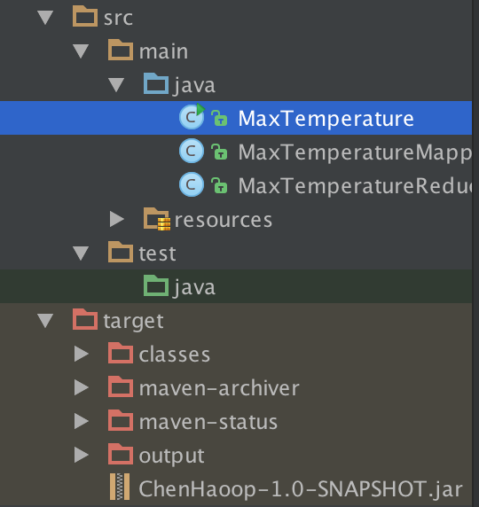

# 本地模式下运行Hadoop

下面是针对Hadoop1.2.1的。

由于默认情况下Hadoop就是针对单机本地模式的，所以除了在`conf/hadoop-evn.sh`指定`JAVA_HOME`，不需要其他配置。（如果你的JAVA_HOME之前已经添加到环境变量，这一步是可以省略的）

这里的程序来自于［Hadoop 权威指南］第二章计算最高温度的例子。

文本文件里存储了包含年份信息和温度信息的记录。

```
0067011990999991950051507004+68750+023550FM-12+038299999V0203301N00671220001CN9999999N9+00001+99999999999
```
需要提取的信息就是 `(1950, 0)`。(记录的具体意义参见［Hadoop 权威指南 第三版］第二章)

在``IntelliJ IEDA``里新建Maven工程，`.pom`文件如下:

```
<?xml version="1.0" encoding="UTF-8"?>
<project xmlns="http://maven.apache.org/POM/4.0.0"
         xmlns:xsi="http://www.w3.org/2001/XMLSchema-instance"
         xsi:schemaLocation="http://maven.apache.org/POM/4.0.0 http://maven.apache.org/xsd/maven-4.0.0.xsd">
    <modelVersion>4.0.0</modelVersion>

    <groupId>com.chen.hadoop</groupId>
    <artifactId>ChenHaoop</artifactId>
    <version>1.0-SNAPSHOT</version>


    <dependencies>
        <dependency>
            <groupId>org.apache.hadoop</groupId>
            <artifactId>hadoop-common</artifactId>
            <version>2.5.1</version>
        </dependency>
        <dependency>
            <groupId>org.apache.hadoop</groupId>
            <artifactId>hadoop-hdfs</artifactId>
            <version>2.5.1</version>
        </dependency>
        <dependency>
            <groupId>org.apache.hadoop</groupId>
            <artifactId>hadoop-client</artifactId>
            <version>2.5.1</version>
        </dependency>
    </dependencies>

</project>
```
请参考下面的问题 ：

- [What is the relationship between Hadoop's version and Hadoop-common's version?](http://stackoverflow.com/questions/28855518/what-is-the-relationship-between-hadoops-version-and-hadoop-commons-version)
- [Differences between Hadoop-common, Hadoop-core and Hadoop-client?](http://stackoverflow.com/questions/28856096/differences-between-hadoop-common-hadoop-core-and-hadoop-client)

Mapper类如下：

```
/**
 * Created by chenzhongpu on 5/3/15.
 */
import org.apache.hadoop.io.IntWritable;
import org.apache.hadoop.io.LongWritable;
import org.apache.hadoop.io.Text;
import org.apache.hadoop.mapreduce.Mapper;

import java.io.IOException;

public class MaxTemperatureMapper extends Mapper<LongWritable, Text, Text, IntWritable> {

    private static final int MISSING = 9999;

    @Override
    public void map(LongWritable key, Text value, Context context)
            throws IOException, InterruptedException{

        String line = value.toString();
        String year = line.substring(15, 19);
        int airTemperature;
        if (line.charAt(87) == '+') { // parseInt doesn't like leading plus signs
            airTemperature = Integer.parseInt(line.substring(88, 92));
        } else {
            airTemperature = Integer.parseInt(line.substring(87, 92));
        }
        String quality = line.substring(92, 93);
        if (airTemperature != MISSING && quality.matches("[01459]")) {
            context.write(new Text(year), new IntWritable(airTemperature));
        }
    }

}
```

Reducer类如下 ：

```
/**
 * Created by chenzhongpu on 5/3/15.
 */
import java.io.IOException;

import org.apache.hadoop.io.IntWritable;
import org.apache.hadoop.io.Text;
import org.apache.hadoop.mapreduce.Reducer;

public class MaxTemperatureReducer
        extends Reducer<Text, IntWritable, Text, IntWritable> {

    @Override
    public void reduce(Text key, Iterable<IntWritable> values,
                       Context context)
            throws IOException, InterruptedException {

        int maxValue = Integer.MIN_VALUE;
        for (IntWritable value : values) {
            maxValue = Math.max(maxValue, value.get());
        }
        context.write(key, new IntWritable(maxValue));
    }
}


```


驱动程序如下:

```
/**
 * Created by chenzhongpu on 5/3/15.
 */
import org.apache.hadoop.fs.Path;
import org.apache.hadoop.io.IntWritable;
import org.apache.hadoop.io.Text;
import org.apache.hadoop.mapreduce.Job;
import org.apache.hadoop.mapreduce.lib.input.FileInputFormat;
import org.apache.hadoop.mapreduce.lib.output.FileOutputFormat;

public class MaxTemperature {

    public static void main(String[] args) throws Exception {
        if (args.length != 2) {
            System.err.println("Usage: MaxTemperature <input path> <output path>");
            System.exit(-1);
        }

        Job job = new Job();
        job.setJarByClass(MaxTemperature.class);
        job.setJobName("Max temperature");

        FileInputFormat.addInputPath(job, new Path(args[0]));
        FileOutputFormat.setOutputPath(job, new Path(args[1]));

        job.setMapperClass(MaxTemperatureMapper.class);
        job.setReducerClass(MaxTemperatureReducer.class);

        job.setOutputKeyClass(Text.class);
        job.setOutputValueClass(IntWritable.class);

        System.exit(job.waitForCompletion(true) ? 0 : 1);
    }
}
```

执行`mvn package`, 将工程打包成 JAR包。



```
%export HADOOP_CLASSPATH=ChenHadoop-1.0-SNAPSHORT.jar
```

```
%hadoop MaxTemperature sample.txt output
```

结果就在output文件夹。
 