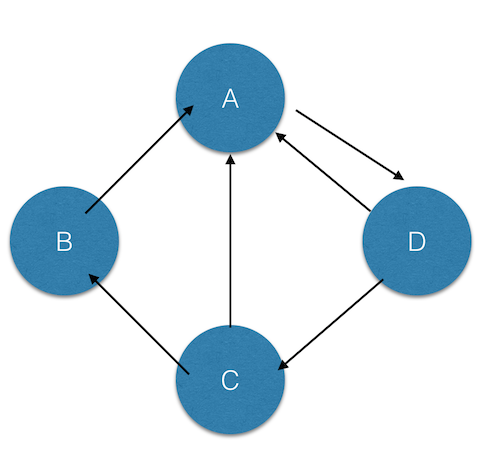

#PageRank
**推广: 更快更好的翻墙神器 [红杏]( http://honx.in/i/VPZdDZnKEyd7byzB)**

---
PageRank的内容细节就不展开的，不清楚的请移步到[PageRank](http://zh.wikipedia.org/wiki/PageRank)。

下面是URL地址以及链接关系：




```
val links = sc.parallelize(Array(('A',Array('D')),('B',Array('A')),
   ('C',Array('A','B')),('D',Array('A','C'))),2).map(x => (x._1, x._2)).cache()
   
var ranks = sc.parallelize(Array(('A',1.0),('B',1.0),('C',1.0),('D',1.0)), 2)

for ( i <- 1 to ITERATIONS){
   val contribs = links.join(ranks, 2)
   val flatMapRDD = contribs.flatMap{case (url,(links,rank)) => links.map(dest => (dest, rank/links.size))}
   val reduceByKeyRDD = flatMapRDD.reduceByKey(_ + _, 2)
   val ranks = reduceByKeyRDD.mapValues(0.15 + 0.85 * _)

} 
```