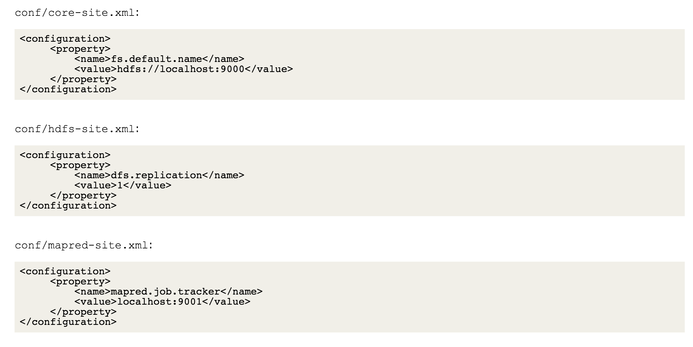
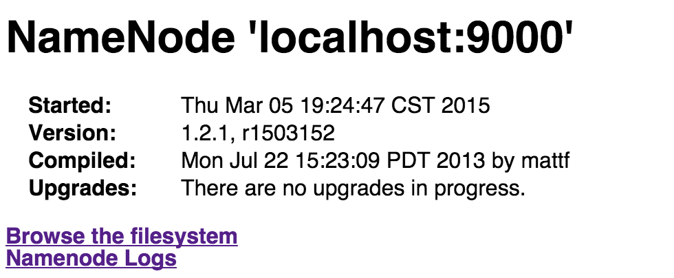
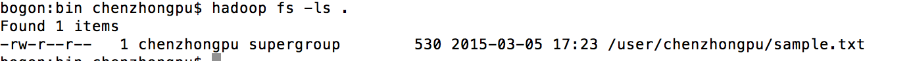

#Spark访问HDFS
**推广: 更快更好的翻墙神器 [红杏]( http://honx.in/i/VPZdDZnKEyd7byzB)**

---
为了使用HDFS，需要配置Hadoop集群。这里使用伪分布式集群（Hadoop版本是1.2.1），参见[Pseudo-Distributed Configuration](http://hadoop.apache.org/docs/r1.2.1/single_node_setup.html)。



其中，`fs.default.name`是用来配置Hadoop的默认文件系统的，Hadoop的守护进程将通过该属性确定namenode 的主机和端口，默认端口是`8020`。


`dfs.replication`是文件系统的副本数，因为Hadoop默认的副本数是3，而我们目前只在一个namenode上运行，必须设置为1。

接下来是配置`ssh`和格式化HDFS文件系统。格式化HDFS文件系统的过程创建一个空文件系统，包含存储目录和namenode持久化的初始版本。（该过程不针对datanode）

下面可以启动 `$HADOOP_HOME/bin`下面的 `start-dfs.sh`。（这里只需要使用HDFS，不需要MapReduce，故没必要执行`start-mapred.sh`，更没必要执行`start-all.sh`）。

namenode的UI-Web界面的默认端口是 50070。访问 http://localhost:50070



将本地一个文件上传到HDFS。

```
hadoop fs -copyFromLocal sample.txt sample.txt
```

第一个sample.txt是本地文件，第二个sample.txt是HDFS相对home目录的。
(sample.txt的内容是前一文章的温度记录，共5行)。


查看HDFS里的内容:



或者在namenode 的UI-Web里查看 `Browse the filesystem`。

执行`spark-shell`，
查看其Web界面，端口4040。

```
val textFile = sc.textFile("hdfs://localhost:9000/user/chenzhongpu/sample.txt")
```

```
textFile.count
```
第二个结果得到5。