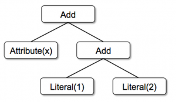
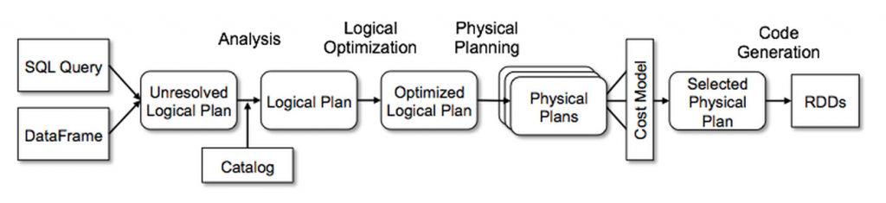

#Catalyst Optimizer优化器
**推广: 更快更好的翻墙神器 [红杏]( http://honx.in/i/VPZdDZnKEyd7byzB)**

---
Spark SQL的优化器Catalyst是易于扩展的。它同时支持基于规则(rule-based)和基于代价(cost-based)的优化方法。

在它内部，Catalyst包含了一个表示树和操作树的规则的通用库。在此框架下，目前实现了针对关系查询处理(如，表达式，逻辑查询计划)的库，和在处理查询执行不同阶段(分析，逻辑优化，物理优化，代码生成)的一些规则。

##Tree
在Catalyst主要的数据类型就是由节点对象组成的树。每个节点都有一个节点类型和0至多个孩子。新节点类型都是Scala里面`TreeNode`的子类。

	Add(Attribute(x), Add(Literal(1), Literal(2)))
	


##Rules
可以使用规则(rules)操纵树，也就是将一棵树转化成另一颗树的方法。虽然规则可以在输入的树上执行任意代码（因为树也仅是一个Scala对象），但通常的做法是使用一系列的pattern matching方法来寻找并使用特定的结果来替换子树。

比如，我们下面实现了折叠(folds)常量间的Add操作：

```
	tree.transform {
  	  case Add(Literal(c1), Literal(c2)) => Literal(c1+c2)
	}
```
这样，对`x+(1+2)`的树使用该规则，就会产生一颗新树`x+3`。

在一个转化的调用中，规则可以进行多次match pattern。

最后，规则的条件及内容是可以包含任意代码的。这使得Catalyst能够对初级用户更简单。

另外，树的转化(transformation)都是在不可变(immutable)树上进行的，这易于调试，也更有利于优化器的并行。

##Using Catalyst in Spark SQL



###Analysis
不管是由SQL parser得到的AST(abstract syntax tree)还是使用API构建的DataFrame对象，关系(relation)里面肯定包含了未解析(unresolved)的属性引用或关系:比如`SELECT col FROM sales`，直到我们查询sales这张表，我们才知道col的类型，甚至col是否是一个合法的列名。

>An attribute is called unresolved if we do not know its type or have not matched it to an input table (or an alias)

Spark SQL使用Catalyst规则和追踪数据源里tables的Catalog对象来解析这些属性。

这部分代码位于 `org.apache.spark.sql.catalyst.analysis.Analyzer.scala`。

###Logical Optimizations
**逻辑优化是完全基于规则(rule-based)的。**

包括：常量折叠(constant folding)、谓词下推(predicate pushdown)、投影减枝(project pruning)、null propagation、BOOL表达式简化，等等。

>predicata pushdown :将外层查询块的 WHERE 子句中的谓词移入所包含的较低层查询块（例如视图），从而能够提早进行数据过滤以及有可能更好地利用索引。

针对不同的情况，添加规则也是及其简单的。

比如下面简化LIKE表达式的：


```
object LikeSimplification extends Rule[LogicalPlan] {
  val startsWith = "([^_%]+)%".r
  val endsWith = "%([^_%]+)".r
  val contains = "%([^_%]+)%".r
  val equalTo = "([^_%]*)".r

  def apply(plan: LogicalPlan): LogicalPlan = plan transformAllExpressions {
    case Like(l, Literal(startsWith(pattern), StringType)) if !pattern.endsWith("\\") =>
      StartsWith(l, Literal(pattern))
    case Like(l, Literal(endsWith(pattern), StringType)) =>
      EndsWith(l, Literal(pattern))
    case Like(l, Literal(contains(pattern), StringType)) if !pattern.endsWith("\\") =>
      Contains(l, Literal(pattern))
    case Like(l, Literal(equalTo(pattern), StringType)) =>
      EqualTo(l, Literal(pattern))
  }
}
```
这段代码的注释是：
>
  Simplifies LIKE expressions that do not need full regular expressions to evaluate the condition.
  For example, when the expression is just checking to see if a string starts with a given pattern.
 
 
这部分代码位于`org.apache.spark.sql.catalyst.optimizer.Optimizer.scala`。

###Physical Planning
在物理计划阶段，Spark SQL通过逻辑计划产生一个或多个物理计划，然后使用代价模型(cost model)选择一个计划。

目前，代码模型只在选择Join算法时被用到：如果一个关系很小，SparkSQL将使用broadcast join，利用其peer-to-peer的broadcast特性。代价模型今后可以被推广在其他算法选择上。

物理计划也会执行基于规则的的优化。

这部分代码位于`org.apache.spark.sql.execution.SparkStrategies.scala`。

###Code Generation
在运行时产生Java子节码是最后阶段的查询优化。

因为Spark SQL基本都是在内存数据集上操作，这是CPU-bound的，所以生成代码可以加速运行。

代码生成引擎是很难实现的，基本相当于一个编译器。但是，依赖Scala语言的新特性`Quasiquotes`，使得它简单得多。Quasiquotes允许程序构建抽象语法树(abstract syntax trees)，在运行时提交给编译器生成子节码。

比如 `(x+y)+1`，如果没有代码生成，这样的表达式会针对每行数据解释，来遍历树的节点，这样会引入大量分支和虚方法的调用。

```
def compile(node: Node): AST = node match {
  case Literal(value) => q"$value"
  case Attribute(name) => q"row.get($name)"
  case Add(left, right) => q"${compile(left)} + ${compile(right)}"
}
```

这部分代码位于`org.spark.sql.catalyst.expressions.codegen.CodeGenerator.scala`。


